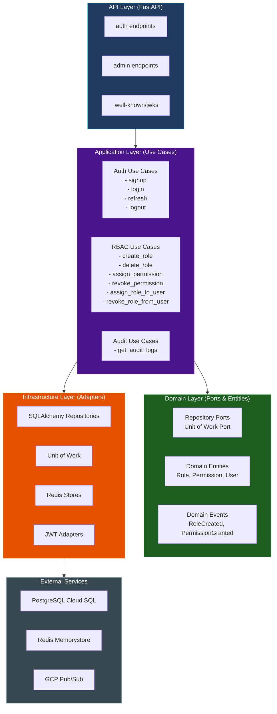
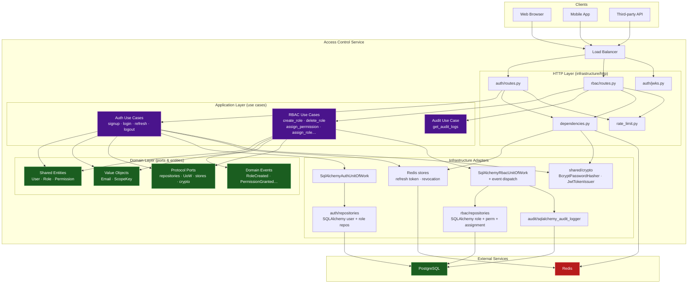
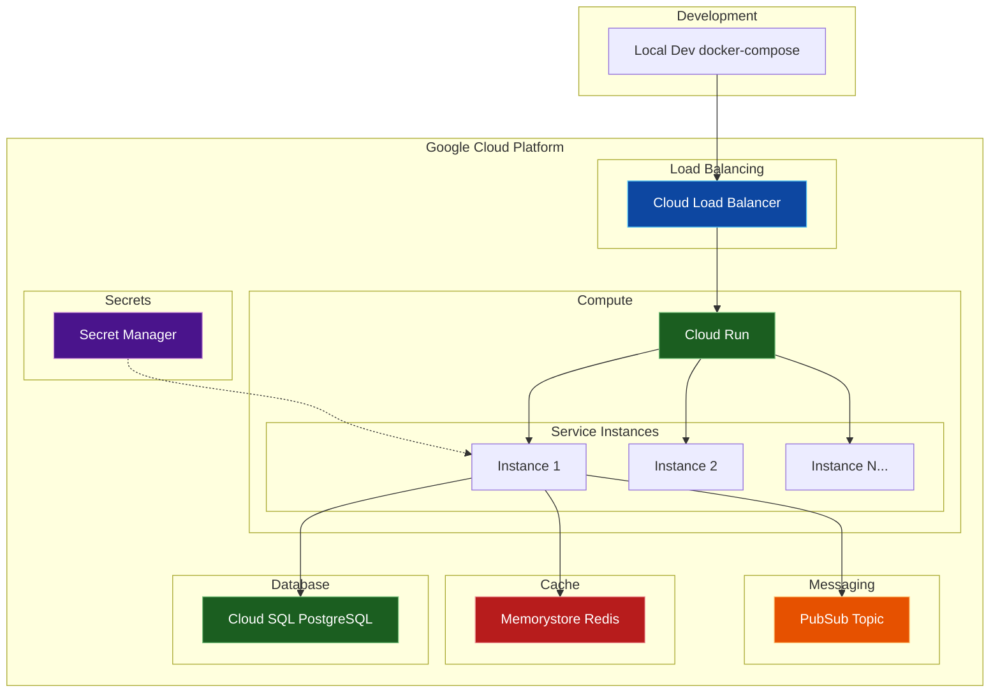

# System Architecture

## Overview

The Access Control Service follows a **hexagonal (ports & adapters) architecture** with clear separation of concerns:

- **Domain Layer**: Pure Python with no external dependencies (no SQLAlchemy, FastAPI, Redis, PyJWT)
- **Application Layer**: Use cases that depend only on `typing.Protocol` ports
- **Infrastructure Layer**: Adapters (SQLAlchemy repos, Redis stores, FastAPI routes, JWT crypto)
- Each bounded context (`auth`, `rbac`, `audit`) is self-contained with its own `domain/`, `application/`, `infrastructure/` subtree



## Layer Responsibilities

### API Layer (`app/*/infrastructure/http/`)

- **Files**: `auth/routes.py`, `rbac/routes.py`, `auth/jwks.py`

**Responsibilities:**
- HTTP request/response handling
- Request validation using Pydantic schemas
- Dependency injection (current user, super user checks)
- Rate limiting (applied as dependencies)
- Setting response headers and cookies
- Mapping domain exceptions to HTTP status codes

### Application Layer (`app/*/application/`)

- **Files**: `auth/application/use_cases/`, `rbac/application/use_cases/`, `audit/application/use_cases/`

**Responsibilities:**
- Business logic implementation (use cases)
- Orchestrating domain entities and repositories
- Transaction management via Unit of Work
- Emitting domain events (RBAC use cases emit events, UoW dispatches after commit)
- DTO (Data Transfer Object) definitions for inputs/outputs

### Domain Layer (`app/*/domain/` and `app/shared/domain/`)

- **Files**: `entities/`, `ports/`, `events.py`, `exceptions.py`, `values/`

**Responsibilities:**
- Domain entity definitions (Role, Permission, User)
- Value objects (Email, ScopeKey)
- Domain events (RoleCreated, PermissionGranted, etc.)
- Repository ports (Protocol interfaces)
- Domain-specific exceptions
- Pure business logic with no external dependencies

### Infrastructure Layer (`app/*/infrastructure/` and `app/shared/infrastructure/`)

- **Files**:
  - `repositories/` - SQLAlchemy repository implementations
  - `unit_of_work.py` - UoW implementation with event dispatching
  - `http/routes.py` - FastAPI route handlers
  - `crypto/` - JWT, password hashing
  - `db/session.py` - Database session management
  - `cache/redis.py` - Redis client
  - `events/` - Event dispatcher and audit logging handler

**Responsibilities:**
- Repository implementations (SQLAlchemy)
- Unit of Work with event dispatching
- HTTP route handlers (FastAPI)
- Cryptographic operations (JWT, bcrypt)
- External service integrations (PostgreSQL, Redis, Pub/Sub)
- Cross-cutting infrastructure concerns

## Component Diagram



## Deployment Diagram



## Data Flow Patterns

### Authentication Flow

```mermaid
flowchart LR
  C1[Client] --> AUTH_ROUTE[auth/routes.py]
  AUTH_ROUTE --> LOGIN_UC[LoginUseCase]
  LOGIN_UC --> USER_REPO[UserRepository]
  USER_REPO --> PG[PostgreSQL]
  LOGIN_UC --> HASHER[BcryptPasswordHasher]
  LOGIN_UC --> ISSUER[JwtTokenIssuer]
  LOGIN_UC --> RT_STORE[Redis refresh token store]
  LOGIN_UC --> RESPONSE[Response + Set-Cookie]
  RESPONSE --> C1

  C2[Client] --> SIGNUP_ROUTE[auth/routes.py]
  SIGNUP_ROUTE --> SIGNUP_UC[SignupUseCase]
  SIGNUP_UC --> UOW_AUTH[AuthUnitOfWork]
  UOW_AUTH --> PG2[PostgreSQL]
  SIGNUP_UC --> RESULT[201 Created]
  RESULT --> C2

  style C1 fill:#0f1720,stroke:#000
  style AUTH_ROUTE fill:#003b52,stroke:#000
  style LOGIN_UC fill:#3b0f4a,stroke:#000
  style HASHER fill:#1f2933,stroke:#000
  style ISSUER fill:#1f2933,stroke:#000
  style RESPONSE fill:#0b1320,stroke:#000
  style RT_STORE fill:#4b0014,stroke:#000
  style C2 fill:#0f1720,stroke:#000
  style SIGNUP_ROUTE fill:#003b52,stroke:#000
  style SIGNUP_UC fill:#3b0f4a,stroke:#000
  style UOW_AUTH fill:#1f2933,stroke:#000
  style PG fill:#184615,stroke:#000
  style PG2 fill:#184615,stroke:#000
  style RESULT fill:#0f1720,stroke:#000
```



### RBAC Administration Flow

```mermaid
flowchart LR
    Super[Super User] --> ADMIN_ROUTE[rbac/routes.py]
    ADMIN_ROUTE --> RBAC_UC[RBAC Use Case]
    RBAC_UC --> UOW_RBAC[SqlAlchemyRbacUnitOfWork]
    UOW_RBAC --> PG[PostgreSQL]
    RBAC_UC --> EVENT[emit DomainEvent]
    EVENT --> UOW_RBAC
    UOW_RBAC --> AUDIT[AuditLogger<br/>on commit]
    AUDIT --> PG
    UOW_RBAC --> RESPONSE[Response]
    RESPONSE --> ADMIN_ROUTE

    style Super fill:#0f1720,stroke:#000
    style ADMIN_ROUTE fill:#003b52,stroke:#000
    style RBAC_UC fill:#3b0f4a,stroke:#000
    style UOW_RBAC fill:#1f2933,stroke:#000
    style PG fill:#184615,stroke:#000
    style EVENT fill:#1b5e20,stroke:#000
    style AUDIT fill:#0b1320,stroke:#000
    style RESPONSE fill:#0f1720,stroke:#000
```



### Token Validation Flow

```mermaid
flowchart LR
    ClientToken[Client with Token] --> API_PROT[API Protected Route]
    API_PROT --> GET_CURR[get_current_user dependency]
    GET_CURR --> VERIFY[verify_access_token]
    VERIFY --> REDIS[Redis JTI revocation check]
    VERIFY --> PGDB[PostgreSQL user load]
    PGDB --> GET_CURR
    GET_CURR --> VALID[Valid Response]

    style ClientToken fill:#0f1720,stroke:#000
    style API_PROT fill:#003b52,stroke:#000
    style GET_CURR fill:#1f2933,stroke:#000
    style VERIFY fill:#1f2933,stroke:#000
    style REDIS fill:#4b0014,stroke:#000
    style PGDB fill:#184615,stroke:#000
    style VALID fill:#0b1320,stroke:#000

```



## Interface Contracts

### Internal Interfaces

**Use Case ↔ Database** (via Unit of Work + Repository ports)
- All database operations use SQLAlchemy async ORM
- Async sessions with `await` on all operations
- Connection pooling managed at engine level
- Transactions are committed explicitly inside each use case via `await uow.commit()`

**Use Case ↔ Redis** (via port adapters)
- `redis.asyncio` client for async operations
- Key patterns:
  - `refresh_token:{token}` → `user_id` (string)
  - `revoked_jti:{jti}` → `"1"` (set with expiry)
  - `rate_limit:ip:{ip}:{endpoint}` → counter (integer)
  - `rate_limit:username:{username}:{endpoint}` → counter (integer)

**Use Case → JWT** (via `TokenIssuer` / `TokenVerifier` ports)
- `JwtTokenIssuer.issue(claims)` returns signed JWT string
- `JwtTokenVerifier.verify(token)` returns `TokenPayload` or raises `InvalidTokenError` / `TokenExpiredError`
- Uses RSA key pair from `app/auth/infrastructure/crypto/key_pair.py`

**HTTP → Use Case**
- Route handlers call `await use_case.execute(input_dto)`
- Domain exceptions mapped to `HTTPException` via `exception_mapper.py`
- API layer never contains business logic

### External Interfaces

**Client → API**
- HTTPS REST API with JSON request/response bodies
- Authentication via `Authorization: Bearer <access_token>` header
- Refresh token via `refresh_token` httpOnly cookie (7-day expiry)
- All errors return JSON with `detail` field

**API → Disco`(Discovery)**
- JWKS endpoint at `/.well-known/jwk`s.json serves public key in JWK format
- Used by clients to validate JWT signatures

**Service → GCP Services**
- Pub/Sub publisher for async event delivery (not yet fully integrated)
- Cloud SQL via SQLAlchemy asyncpg driver
- Memorystore via Redis client

## Technology Choices & Rationale

### Why FastAPI?
- **Async-first**: Native support for async/await, critical for I/O-bound operations
- **Automatic docs**: OpenAPI/Swagger generated from code annotations
- **Pydantic v2**: Built-in request/response validation with modern typing
- **Performance**: On par with Node.js and Go in benchmarks
- **Type safety**: Full Python type hint support for IDE assistance

### Why SQLAlchemy 2.x async?
- Mature ORM with comprehensive feature set
- Full async support with `asyncpg` driver
- 2.0 style (futures) provides cleaner API than 1.4 style
- Migration path from existing Django ORM knowledge
- Alembic integration for schema migrations

### Why PyJWT over python-jose?
- Actively maintained (python-jose is deprecated)
- Better cryptography backend (`cryptography` library)
- More secure defaults
- Simpler API surface area

### Why Redis for token revocation?
- In-memory store provides O(1) lookup for JTI revocation checks
- TTL support ensures automatic cleanup of expired revoked tokens
- High performance under load
- GCP Memorystore provides managed Redis with HA

### Why RS256?
- Asymmetric cryptography: private key stays secret, public key distributed
- Supports key rotation via JWKS endpoint
- Industry standard for JWT signing (RFC 7518)
- Better security than HS256 (shared secret)

### Why bcrypt for passwords?
- Intentionally slow hashing algorithm resists brute force
- Adaptive work factor can be increased over time
- Widely industry standard
- `passlib` provides lazy migration from legacy schemes

### Why GCP Pub/Sub?
- Decouples event production from consumption
- Provides durable message storage
- Supports multiple subscribers (activity tracker, analytics, etc.)
- Scalable and managed service

## Non-Functional Characteristics

### Scalability
- **Horizontal Scaling**: Stateless API instances can be added behind load balancer
- **Database Connection Pool**: Configurable pool size (default 10) with overflow (default 20)
- **Redis Cluster**: Memorystore supports sharding for large datasets
- **Async I/O**: Single-threaded event loop handles thousands of concurrent connections

### Availability
- **99.95% Target**: Managed services (Cloud SQL HA, Memorystore, Pub/Sub) provide SLAs
- **Stateless Design**: Instances can be terminated and replaced without data loss
- **Graceful Shutdown**: Lifespan hooks ensure proper connection cleanup
- **Health Checks**: Startup verification of DB and Redis connectivity

### Security
- **Secrets Management**: All secrets injected via environment variables or GCP Secret Manager
- **Principle of Least Privilege**: Fine-grained permissions, super user required for admin ops
- **Defense in Depth**: Multiple security layers (network, application, data)
- **Encryption in Transit**: TLS for all external communications
- **Encryption at Rest**: Cloud SQL and Memorystore provide disk encryption

### Observability
- **Structured Logging**: JSON format with severity, request_id, timestamps
- **Request Tracing**: X-Request-ID header propagated through system
- **Metrics**: Ready for Prometheus/GCP Monitoring integration (middleware can be added)
- **Audit Trail**: All RBAC operations logged with actor, action, entity, payload

## Future Extensibility

### Planned Enhancements
1. Permission middleware (`@require_permission("resource:action")`)
2. Query-time soft delete filters (global query hooks)
3. GCP Secret Manager integration for production keys
4. Pub/Sub event publishing for all audit log entries
5. API versioning strategy (v2 endpoints)
6. OAuth2 social login integration
7. Multi-factor authentication (MFA)
8. Password reset flow
7. Email verification

### Extension Points
- New service classes can be added without modifying existing ones
- New API routers can be mounted at any prefix
- New model mixins can be created and inherited
- Additional Pydantic schemas can be defined for new use cases
- Rate limiting strategies can be swapped
- Logging handlers can be added for different destinations

## Dependencies

### Python Packages (from pyproject.toml)

```
fastapi>=0.110.0
uvicorn[standard]>=0.30.0
sqlalchemy>=2.0.0
alembic>=1.13.0
asyncpg>=0.29.0
redis>=5.0.0
pyjwt>=2.8.0
cryptography>=41.0.0
passlib[bcrypt]>=1.7.4
pydantic>=2.0.0
pydantic-settings>=2.0.0
httpx>=0.27.0
pytest>=8.0.0
pytest-asyncio>=0.23.0
google-cloud-pubsub>=2.19.0
```

All dependencies managed by `uv` with locked versions in `uv.lock`.

## References

- `app/main.py` - Application factory and lifespan
- `app/config.py` - Configuration definitions
- `app/auth/` - Authentication bounded context (domain, application, infrastructure)
- `app/rbac/` - RBAC bounded context (domain, application, infrastructure)
- `app/audit/` - Audit bounded context (domain, infrastructure)
- `app/shared/domain/` - Shared domain primitives (entities, events, ports, values)
- `app/shared/infrastructure/` - Shared infrastructure (db, cache, crypto, events, http)
- `tests/unit/rbac/` - RBAC use case unit tests with fakes
