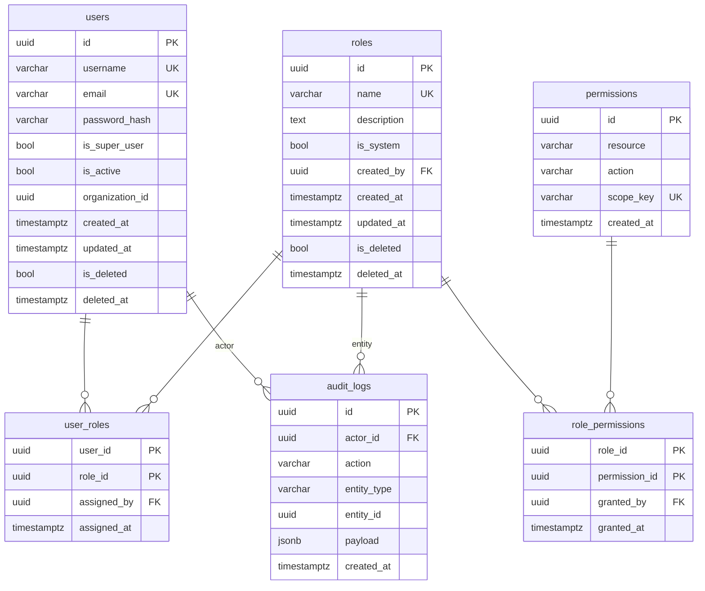

# Data Models & Database

## Overview

In the hexagonal architecture, there is a clear separation between:

- **Domain Entities** (`app/shared/domain/entities/`): Pure Python dataclasses representing business concepts (Role, Permission, User). These have no dependencies on SQLAlchemy or any infrastructure concerns.
- **ORM Models** (`app/*/infrastructure/orm/`): SQLAlchemy declarative models that map to database tables. These are infrastructure concerns.

The repository pattern bridges these two worlds: repositories accept and return domain entities, while internally using ORM models for persistence.

## Entity Relationship Diagram



**Legend**:
- `PK` = Primary Key
- `FK` = Foreign Key
- `UK` = Unique Constraint
- `o{` = one-to-many
- `||` = many-to-one (with composite PK for associations)

---

## Table Definitions

### `users`

Primary table storing user credentials and profile.

**Columns**:

| Name | Type | Constraints | Description |
|------|------|-------------|-------------|
| `id` | `UUID` | `PRIMARY KEY`, `DEFAULT gen_random_uuid()` | Surrogate key |
| `username` | `VARCHAR(255)` | `UNIQUE`, `NOT NULL` | Login username |
| `email` | `VARCHAR(255)` | `UNIQUE`, `NULL` | Optional email address |
| `password_hash` | `VARCHAR(255)` | `NOT NULL` | Bcrypt hash (or legacy PBKDF2) |
| `is_super_user` | `BOOLEAN` | `DEFAULT false`, `NOT NULL` | Admin override flag |
| `is_active` | `BOOLEAN` | `DEFAULT true`, `NOT NULL` | Account activation status |
| `organization_id` | `UUID` | `NULL` | Optional organizational grouping (no FK) |
| `created_at` | `TIMESTAMPTZ` | `DEFAULT NOW()` | Auto-created timestamp |
| `updated_at` | `TIMESTAMPTZ` | `DEFAULT NOW()`, `ON UPDATE NOW()` | Auto-updated timestamp |
| `is_deleted` | `BOOLEAN` | `DEFAULT false`, `NOT NULL` | Soft delete flag |
| `deleted_at` | `TIMESTAMPTZ` | `NULL` | Deletion timestamp |

**Indexes**:
- `users_username_key` (unique)
- `users_email_key` (unique)
- `users_is_deleted_idx` (for filtering active users)

**Soft Delete**: Deleted users remain in DB but are filtered by `is_deleted=False` in queries. The application code must manually apply this filter (not automatic via SQLAlchemy event).

**Mixins**: Inherits `TimestampMixin`, `SoftDeleteMixin` (`app/shared/infrastructure/db/base.py`)

---

### `roles`

Role definitions for RBAC.

**Columns**:

| Name | Type | Constraints | Description |
|------|------|-------------|-------------|
| `id` | `UUID` | `PRIMARY KEY`, `DEFAULT gen_random_uuid()` | Role ID |
| `name` | `VARCHAR(100)` | `UNIQUE`, `NOT NULL` | Role name (e.g., "admin") |
| `description` | `TEXT` | `NULL` | Human-readable description |
| `is_system` | `BOOLEAN` | `DEFAULT false`, `NOT NULL` | Protected from deletion |
| `created_by` | `UUID` | `FK users.id SET NULL`, `NULL` | Creator reference |
| `created_at` | `TIMESTAMPTZ` | `DEFAULT NOW()` | Timestamp |
| `updated_at` | `TIMESTAMPTZ` | `DEFAULT NOW()`, `ON UPDATE NOW()` | Timestamp |
| `is_deleted` | `BOOLEAN` | `DEFAULT false`, `NOT NULL` | Soft delete |
| `deleted_at` | `TIMESTAMPTZ` | `NULL` | Deletion timestamp |

**Indexes**:
- `roles_name_key` (unique)
- `roles_is_deleted_idx`

**System Roles**: Built-in roles (e.g., 'viewer') should have `is_system=True` to prevent deletion. Seeded via migration or initial data script.

**Mixins**: Inherits `TimestampMixin`, `SoftDeleteMixin`

**Foreign Key**: `created_by` references `users.id` with `ON DELETE SET NULL` (if creator deleted, role persists)

---

### `permissions`

Permission definitions defining allowable actions.

**Columns**:

| Name | Type | Constraints | Description |
|------|------|-------------|-------------|
| `id` | `UUID` | `PRIMARY KEY`, `DEFAULT gen_random_uuid()` | Permission ID |
| `resource` | `VARCHAR(100)` | `NOT NULL` | Resource type (e.g., "users", "roles") |
| `action` | `VARCHAR(100)` | `NOT NULL` | Action (e.g., "read", "write", "delete") |
| `scope_key` | `VARCHAR(255)` | `UNIQUE`, `NOT NULL` | Composite `resource:action` |
| `created_at` | `TIMESTAMPTZ` | `DEFAULT NOW()` | Creation timestamp |

**Indexes**:
- `permissions_scope_key_key` (unique)
- `permissions_resource_action_idx` (optional, for querying by parts)

**Computed Field**: `scope_key` typically generated as `f"{resource}:{action}"` in service layer (`rbac_service.py:114`) and stored denormalized for efficient lookup.

**No Soft Delete**: Permissions are immutable once created; no `is_deleted` column. Deleting permissions would break RBAC integrity; instead revoke associations.

---

### `user_roles`

Association table linking users to roles (many-to-many).

**Columns**:

| Name | Type | Constraints | Description |
|------|------|-------------|-------------|
| `user_id` | `UUID` | `PK`, `FK users.id ON DELETE CASCADE`, `NOT NULL` | User reference |
| `role_id` | `UUID` | `PK`, `FK roles.id ON DELETE CASCADE`, `NOT NULL` | Role reference |
| `assigned_by` | `UUID` | `FK users.id ON DELETE SET NULL`, `NULL` | Actor who assigned |
| `assigned_at` | `TIMESTAMPTZ` | `DEFAULT NOW()` | Assignment timestamp |

**Primary Key**: Composite `(user_id, role_id)`

**Foreign Keys**:
- `user_id` → `users.id` with `ON DELETE CASCADE`: If user deleted, all role assignments removed
- `role_id` → `roles.id` with `ON DELETE CASCADE`: If role deleted (soft delete does not trigger CASCADE), all assignments removed (note: soft delete does NOT cascade; physical delete does)
- `assigned_by` → `users.id` with `ON DELETE SET NULL`: If actor deleted, reference becomes NULL

**Indexes**: PK automatically indexes both columns

**File**: `app/rbac/infrastructure/orm/association.py`

---

### `role_permissions`

Association table linking roles to permissions (many-to-many).

**Columns**:

| Name | Type | Constraints | Description |
|------|------|-------------|-------------|
| `role_id` | `UUID` | `PK`, `FK roles.id ON DELETE CASCADE`, `NOT NULL` | Role reference |
| `permission_id` | `UUID` | `PK`, `FK permissions.id ON DELETE CASCADE`, `NOT NULL` | Permission reference |
| `granted_by` | `UUID` | `FK users.id ON DELETE SET NULL`, `NULL` | Actor who granted |
| `granted_at` | `TIMESTAMPTZ` | `DEFAULT NOW()` | Grant timestamp |

**Primary Key**: Composite `(role_id, permission_id)`

**Foreign Keys**:
- `role_id` → `roles.id` `ON DELETE CASCADE`
- `permission_id` → `permissions.id` `ON DELETE CASCADE`
- `granted_by` → `users.id` `ON DELETE SET NULL`

**Indexes**: PK covers both columns

**File**: `app/rbac/infrastructure/orm/association.py`

---

### `audit_logs`

Immutable audit trail for RBAC operations.

**Columns**:

| Name | Type | Constraints | Description |
|------|------|-------------|-------------|
| `id` | `UUID` | `PRIMARY KEY`, `DEFAULT gen_random_uuid()` | Log entry ID |
| `actor_id` | `UUID` | `FK users.id SET NULL`, `NULL` | Who performed action |
| `action` | `VARCHAR(255)` | `NOT NULL` | Action type enum |
| `entity_type` | `VARCHAR(255)` | `NOT NULL` | Entity type ("role", "permission", "user_role") |
| `entity_id` | `UUID` | `NULL` | Affected entity ID (may be NULL for some actions) |
| `payload` | `JSONB` | `NULL` | Additional structured data |
| `created_at` | `TIMESTAMPTZ` | `DEFAULT NOW()` | When action occurred |

**Indexes**:
- `audit_logs_created_at_idx` (descending for time-series queries)
- `audit_logs_actor_id_idx` (by actor)
- `audit_logs_entity_type_entity_id_idx` (by target entity)

**JSONB Payload**: PostgreSQL `JSONB` allows indexing and querying. Schema varies by action:
- `ROLE_CREATED`: `{"name": "editor", "description": "..."}`
- `PERMISSION_GRANTED`: `{"role_id": "...", "permission_scope": "users:read"}`
- `USER_ROLE_ASSIGNED`: `{"user_id": "...", "role_id": "..."}`
- etc.

**Immutable**: No `is_deleted` column; entries never modified or deleted (compliance requirement).

**Mixins**: None (only `created_at` is present)

**File**: `app/audit/infrastructure/orm/audit_log.py`

---

## Constraints & Integrity

### Unique Constraints
- `users.username` (case-sensitive? PostgreSQL default is case-sensitive)
- `users.email` (nullable but unique via partial index? Actually unique allows single NULL; multiple NULLs would violate SQL standard but PostgreSQL allows multiple NULLs in unique constraint)
- `roles.name`
- `permissions.scope_key`

**Note**: The codebase implementation treats email uniqueness as true unique, but PostgreSQL unique constraint allows multiple NULLs. To enforce uniqueness only for non-null values, a partial index would be needed: `CREATE UNIQUE INDEX users_email_unique_idx ON users(email) WHERE email IS NOT NULL`. Current implementation likely uses simple UNIQUE, meaning only one NULL allowed if unique constraint. Check actual migration.

### Foreign Keys
- `users.created_by` → `users.id` (self-referential, SET NULL)
- `roles.created_by` → `users.id` (SET NULL)
- `user_roles.user_id` → `users.id` (CASCADE)
- `user_roles.role_id` → `roles.id` (CASCADE)
- `user_roles.assigned_by` → `users.id` (SET NULL)
- `role_permissions.role_id` → `roles.id` (CASCADE)
- `role_permissions.permission_id` → `permissions.id` (CASCADE)
- `role_permissions.granted_by` → `users.id` (SET NULL)
- `audit_logs.actor_id` → `users.id` (SET NULL)

### Check Constraints (Implicit/Explicit)
- No explicit check constraints defined in SQLAlchemy models (could be added via `CheckConstraint`)
- Application-level validation ensures:
  - `scope_key` matches `resource:action` format
  - `is_super_user` only on users
  - `is_system` only on roles

### Default Values
All timestamps use `server_default=func.now()` to set from database server time (ensures consistency across timezones).
UUIDs use `gen_random_uuid()` (PostgreSQL pgcrypto extension required).

---

## Migrations (Alembic)

Migration files reside in `alembic/versions/`.

**Generating Migrations**:
```bash
uv run alembic revision --autogenerate -m "description"
```

**Applying Migrations**:
```bash
uv run alembic upgrade head
```

The migration autogenerate feature detects model changes and generates ALTER statements. Manual review required before applying to production.

**Common Migration Operations**:
- Adding new tables
- Adding new columns (with or without defaults)
- Adding indexes
- Adding foreign keys
- Modifying column types
- Adding check constraints

**Important**: Soft delete columns (`is_deleted`, `deleted_at`) and timestamp mixins are already present in initial schema. Future migrations should preserve soft-deleted rows.

---

## Soft Delete Strategy

### What is Soft Deleted?
- `User`: `users.is_deleted=True`, `deleted_at` set
- `Role`: `roles.is_deleted=True`, `deleted_at` set

### What is NOT Soft Deleted?
- `Permission`: No soft delete; once created, persists forever
- `AuditLog`: Immutable; never deleted
- Association tables: When parent is physically deleted (CASCADE), rows removed. Soft delete on parent does NOT automatically cascade; association rows remain unless explicitly cleaned up.

### Query Filtering
There is **no global query filter** implemented. Every query must manually filter:

```python
# Correct:
stmt = select(User).where(User.is_deleted == False)

# BUG: This would return soft-deleted users:
stmt = select(User)  # Missing filter
```

**Recommendation**: Implement SQLAlchemy `with_loader_criteria()` event to auto-include `is_deleted=False` filter on all queries for models that have the column. This is not currently in the codebase.

---

## Database Seeding

### Required Initial Data

1. **Create 'viewer' role** (system role)
   ```sql
   INSERT INTO roles (id, name, description, is_system, created_at)
   VALUES (gen_random_uuid(), 'viewer', 'Default read-only role', true, NOW());
   ```

   This role must exist before any user signup (see `auth_service.py:97` which raises `RuntimeError` if not found).

### Optional Initial Data

- Create initial super user
- Seed common permissions (e.g., `users:read`, `roles:write`, etc.)

Seeding can be done via:
- Alembic data migration (recommended for reproducibility)
- Standalone script (`scripts/seed.py`)
- Manual SQL

---

## Indexing Strategy

### Essential Indexes (likely present in migrations)
- All `UNIQUE` constraints automatically create unique indexes
- Foreign key columns may benefit from explicit indexes for cascade performance (CASCADE uses PK indexes on parent; child FK indexes not strictly required but recommended for deletion speed)

### Query-Specific Indexes
Based on common query patterns:

```sql
-- Find active user by username (most frequent)
CREATE INDEX idx_users_username_active ON users(username) WHERE is_deleted = false;

-- Get user roles efficiently
-- Already covered by PK on user_roles, but also:
CREATE INDEX idx_user_roles_user_id ON user_roles(user_id);
CREATE INDEX idx_user_roles_role_id ON user_roles(role_id);

-- Get role permissions efficiently
CREATE INDEX idx_role_permissions_role_id ON role_permissions(role_id);
CREATE INDEX idx_role_permissions_permission_id ON role_permissions(permission_id);

-- Audit logs by time (already using created_at DESC order)
CREATE INDEX idx_audit_logs_created_at_desc ON audit_logs(created_at DESC);
CREATE INDEX idx_audit_logs_actor_id ON audit_logs(actor_id);

-- Permission lookup by scope_key (unique index already exists)
```

Note: SQLAlchemy migrations may automatically create some indexes based on relationship loading patterns.

---

## Database Connections

### Connection Pool Configuration (`app/shared/infrastructure/db/session.py`)

```python
async_engine = create_async_engine(
    str(settings.database_url),
    echo=settings.app_debug,        # Log SQL in debug mode
    pool_size=settings.pool_size,  # Default 10
    max_overflow=settings.max_overflow,  # Default 20 (allows 30 total briefly)
)
```

**Explanation**:
- `pool_size`: Base number of connections maintained
- `max_overflow`: Additional connections allowed beyond pool_size under load
- Total max connections = `pool_size + max_overflow` = 30 by default
- Connections are returned to pool after use (not closed)

**Production Recommendations**:
- Monitor connection count; increase pool_size based on instance count
- Cloud SQL connection limits apply (max 100-500 depending on tier)
- Set `pool_recycle` if needed to avoid stale connections (typically 3600 seconds)

### Async Session Pattern

```python
async def get_db() -> AsyncGenerator[AsyncSession, None]:
    async with async_session_factory() as session:
        try:
            yield session
            await session.commit()
        except Exception:
            await session.rollback()
            raise
```

**Key Points**:
- `expire_on_commit=False` prevents `DetachedInstanceError` after commit (`app/shared/infrastructure/db/session.py`)
- Session auto-closes via context manager
- All route handlers must consume this dependency to get DB session

---

## Data Access Patterns

### Eager Loading to Avoid N+1

Repositories use `selectinload()` for relationships to avoid N+1 queries:

```python
# Load user with roles and permissions (in UserRepository)
stmt = (
    select(UserORM)
    .options(
        selectinload(UserORM.roles).selectinload(RoleORM.permissions)
    )
    .where(UserORM.username == username, UserORM.is_deleted == False)
)
```

This generates two additional queries:
1. Load roles for user
2. Load permissions for all those roles (using `IN` clause)

**Alternative**: `joinedload()` could combine into one large JOIN query but may produce Cartesian product for many-to-many; `selectinload` is preferred.

---

## References

- ORM Models:
  - `app/auth/infrastructure/orm/user.py`
  - `app/rbac/infrastructure/orm/role.py`
  - `app/rbac/infrastructure/orm/association.py`
  - `app/audit/infrastructure/orm/audit_log.py`
  - `app/shared/infrastructure/db/base.py`
- Domain Entities: `app/shared/domain/entities/`
- Database session: `app/shared/infrastructure/db/session.py`
- Migrations: `alembic/`
- Use cases: `app/auth/application/use_cases/`, `app/rbac/application/use_cases/`
