# Sequence Diagrams

This document provides visual sequence diagrams for key flows in the Access Control Service, using Mermaid syntax.

---

## 1. User Signup Flow

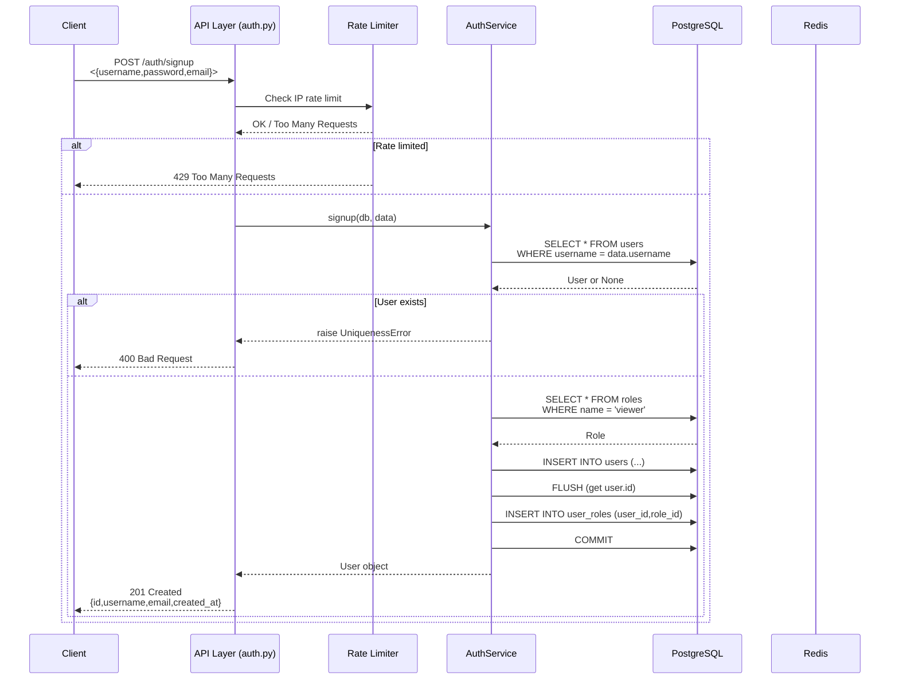

**Key Points**:
- Rate limiting by IP applied upfront
- Uniqueness check for username (and email if provided)
- Viewer role must exist in database (seeded separately)
- Transaction commits in API layer after service returns

---

## 2. User Login Flow

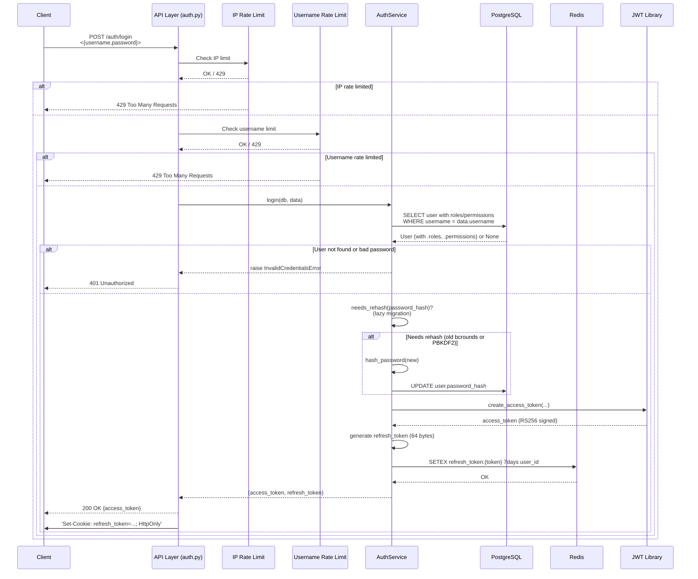

**Key Points**:
- Double rate limiting: IP (20/min) and username (5/5min)
- Eager loading with `selectinload` to avoid N+1 queries
- Lazy bcrypt migration triggered if `needs_rehash()`
- Refresh token stored in Redis with 7-day TTL
- Refresh token sent as httpOnly cookie (not in JSON body)

---

## 3. Token Refresh Flow

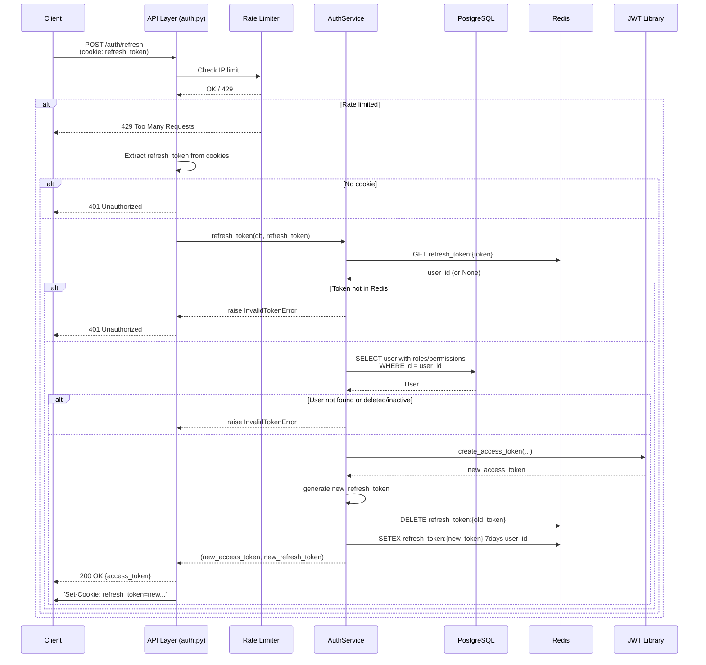

**Key Points**:
- Refresh token rotation: old token deleted, new token issued
- Prevents replay attacks: stolen refresh token can only be used once
- Both tokens returned in responses; client must update cookie
- User re-fetched from DB; if user deleted, refresh fails
- Rate limiting by IP to prevent abuse

---

## 4. Token Revocation (Logout)

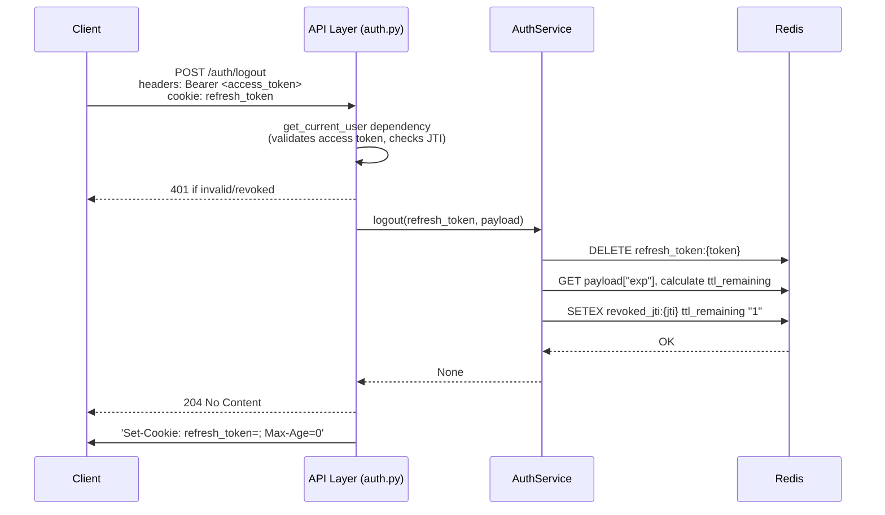

**Key Points**:
- Access token remains valid until expiry, but JTI revoked in Redis
- Refresh token immediately deleted from Redis
- Subsequent requests with access token will fail due to JTI check
- New refresh token cannot be issued (existing one deleted)
- Logout does not immediately invalidate access token; relies on client to stop using it

---

## 5. Protected Endpoint Access

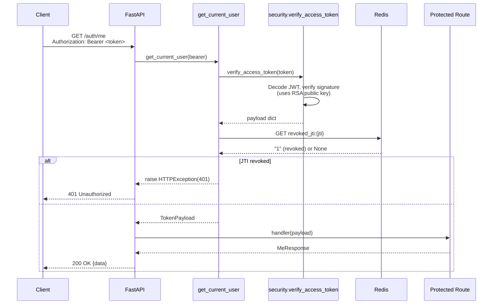

**Key Points**:
- Dependency chain: `get_current_user` runs before route handler
- Token signature verified against RSA public key
- JTI revocation checked on EVERY request
- Returns 401 if token expired, invalid signature, or revoked
- Payload injected as `TokenPayload` for route use

---

## 6. Create Role (Admin)

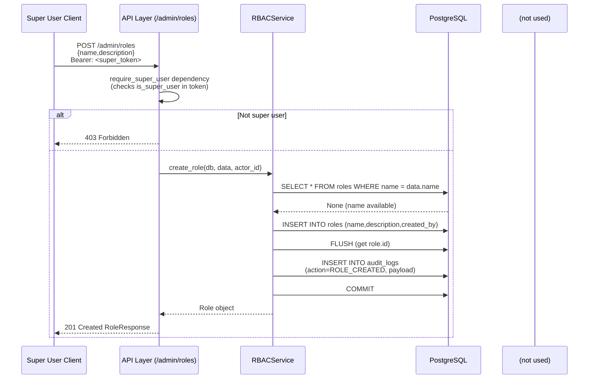

**Key Points**:
- `require_super_user` dependency checked before invoking service
- Role name uniqueness enforced
- Audit log entry created in same transaction
- Service does not commit; caller (API layer) commits after response prepared (but in practice service flush/refresh requires commit before return; see note in component details)

---

## 7. Assign Permission to Role (Auto-Creation)

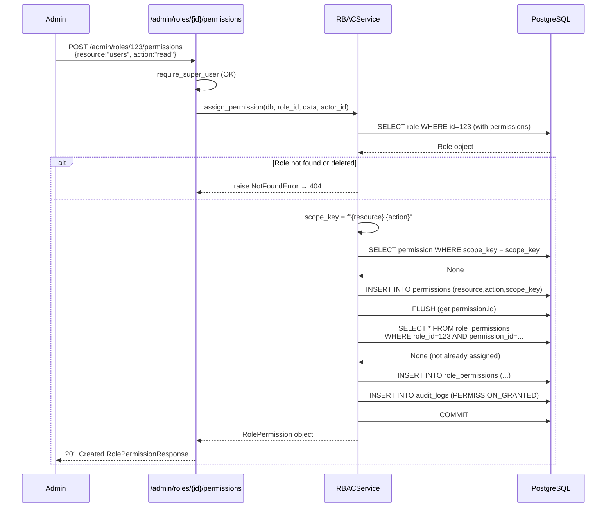

**Key Points**:
- Permission auto-created if scope_key missing
- Double-check to avoid duplicate association (DB query bypassing session cache)
- Audit log records actor and both IDs

---

## 8. Get Audit Logs (Paginated)

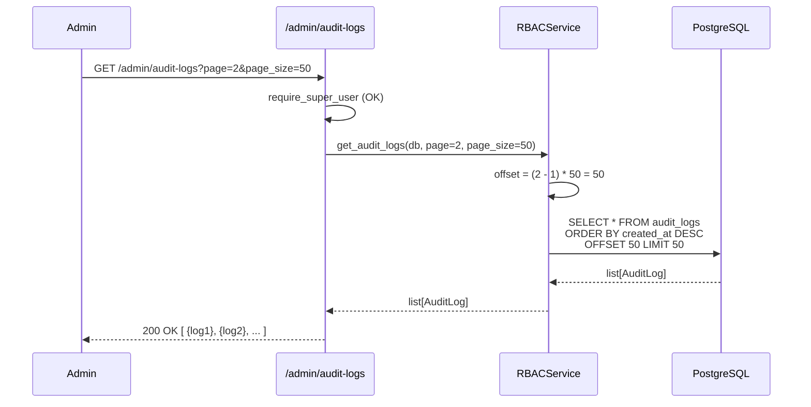

**Key Points**:
- Pagination via `OFFSET` and `LIMIT`
- Ordered by most recent first (`created_at DESC`)
- No filter by actor or action (could be added if needed)
- Returns raw JSONB payload from DB as dict

---

## 9. JWKS Endpoint

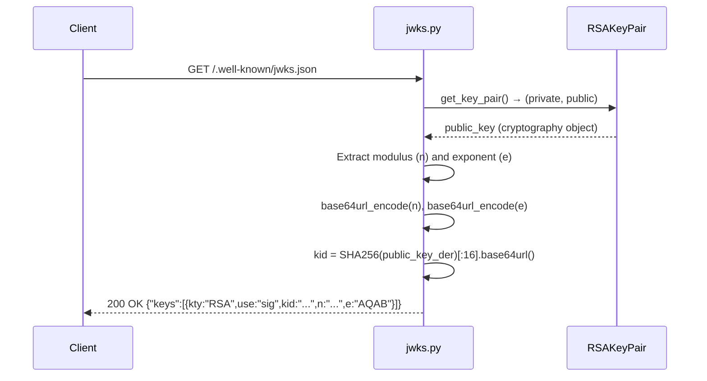

**Key Points**:
- Public key only; private never exposed
- `kid` derived from public key content (consistent across restarts if same key)
- Base64url encoding without padding as per JWK spec
- Single key currently; multi-key rotation would require storing multiple keys and selecting by `kid` in JWT header

---

## 10. Rate Limit Enforcement (IP)

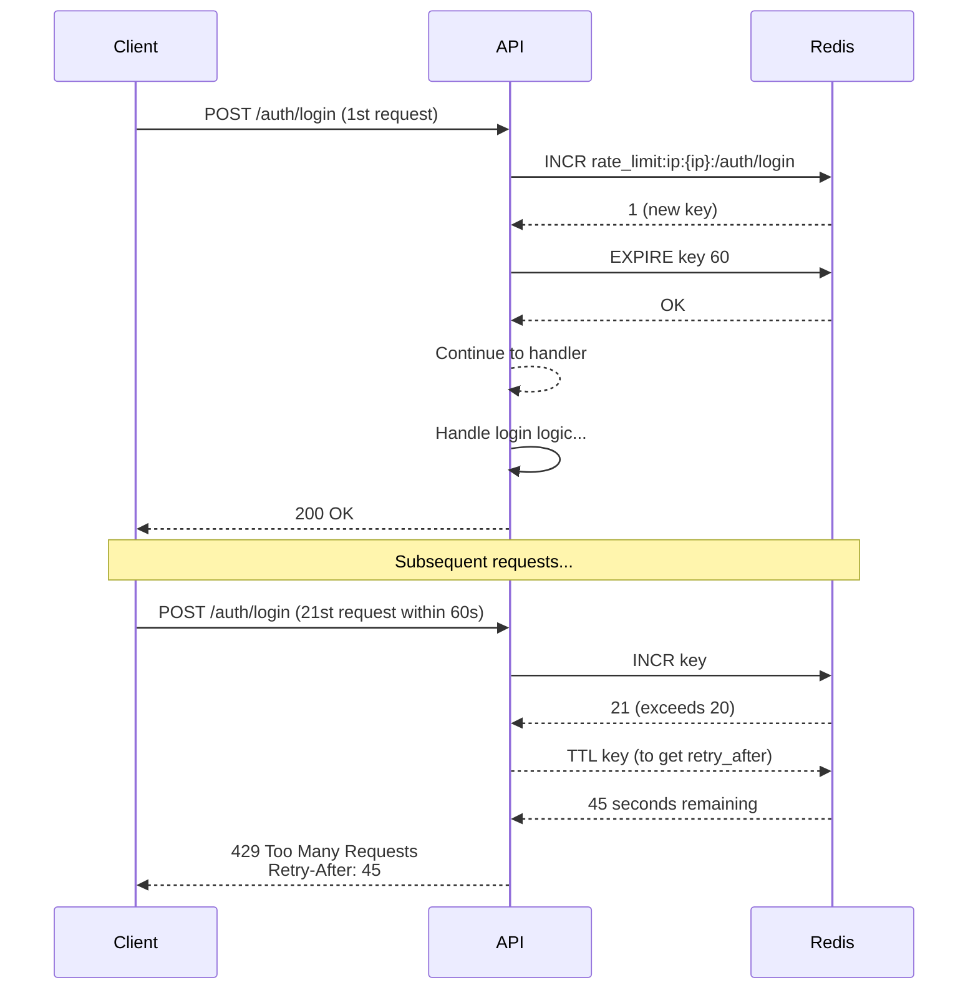

**Key Points**:
- Key includes IP address AND endpoint path
- TTL set on first request; subsequent requests don't reset it
- Counter increments atomically via Redis INCR
- 429 includes `Retry-After` header with seconds to wait

---

## 11. Super User Dependency Check

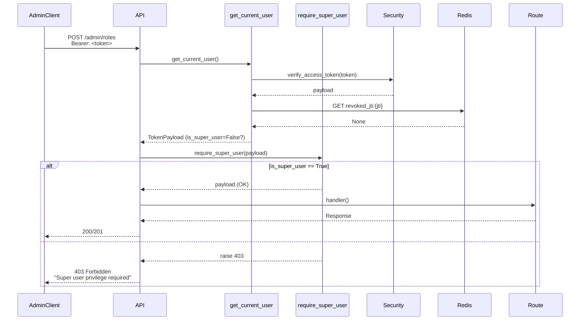

**Key Points**:
- Dependencies are chained: `require_super_user` depends on `get_current_user`
- Both executed before route handler
- 403 raised before any business logic runs

---

## References

- Auth endpoints: `app/api/v1/auth.py:14-192`
- Admin endpoints: `app/api/v1/admin.py:16-291`
- JWKS: `app/api/v1/jwks.py:13-59`
- AuthService: `app/services/auth_service.py:39-269`
- RBACService: `app/services/rbac_service.py:22-293`
- Security: `app/core/security.py:13-81`
- Dependencies: `app/core/dependencies.py:14-66`
- Rate limiting: `app/core/rate_limit.py:15-70`
