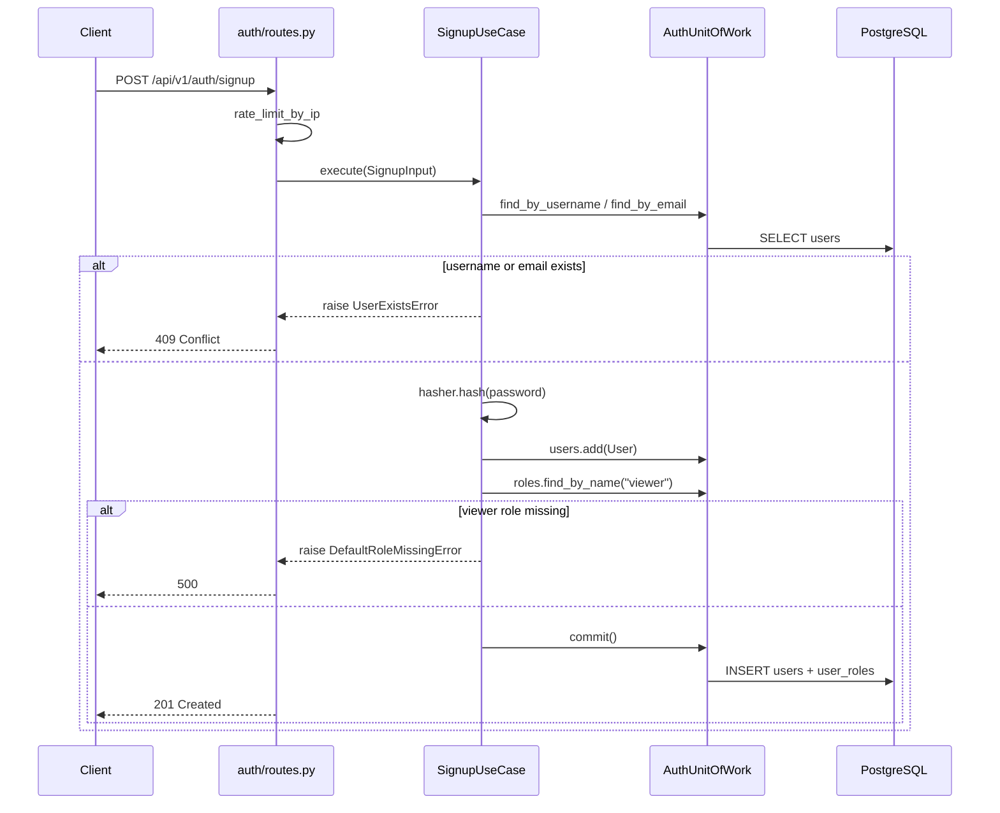
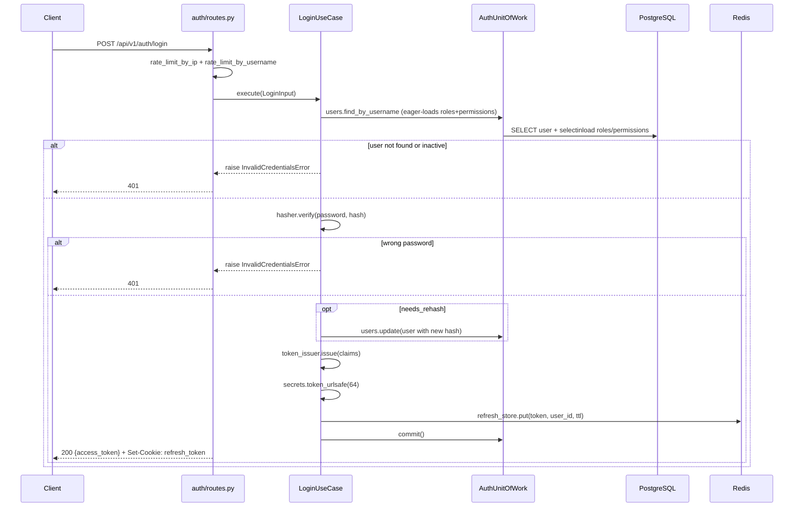
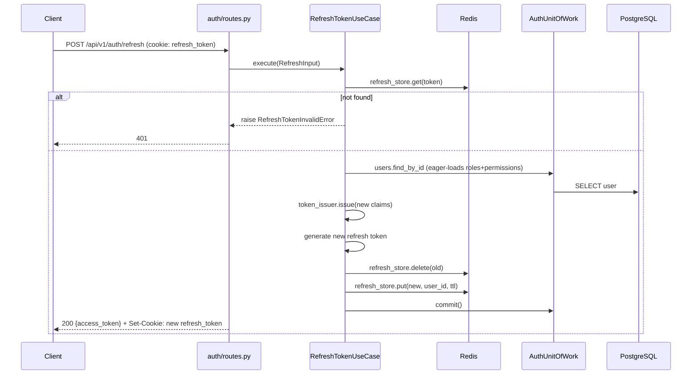
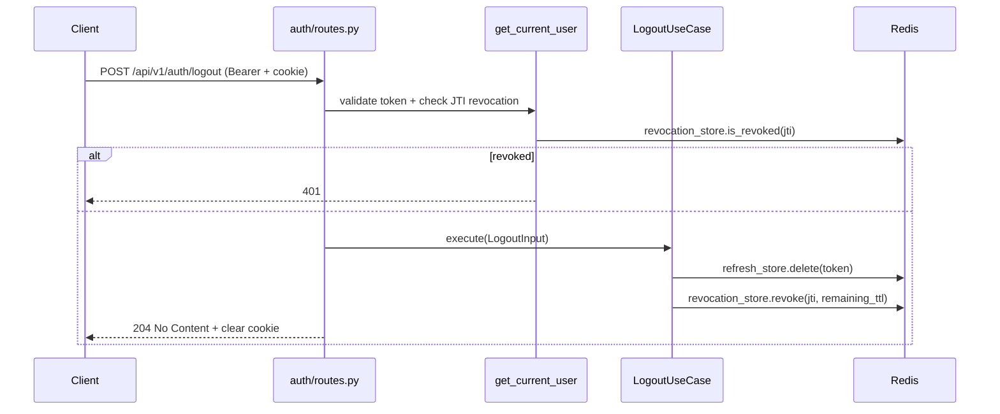
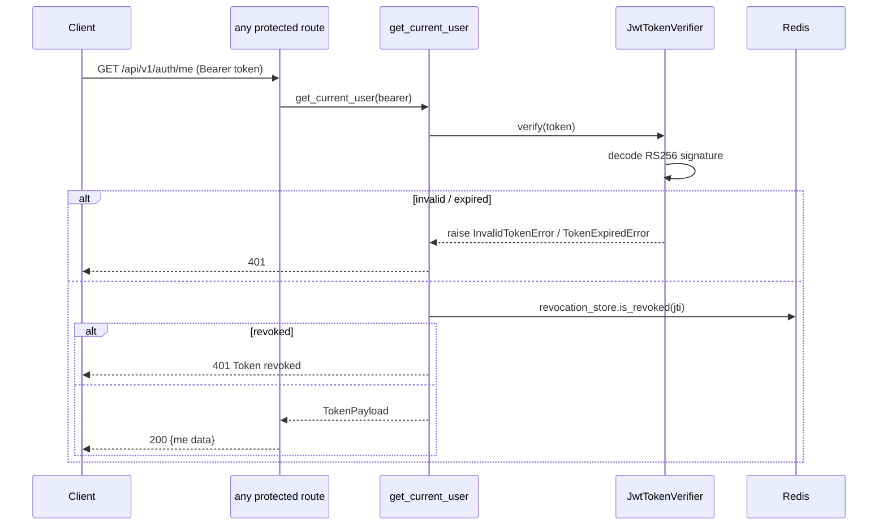
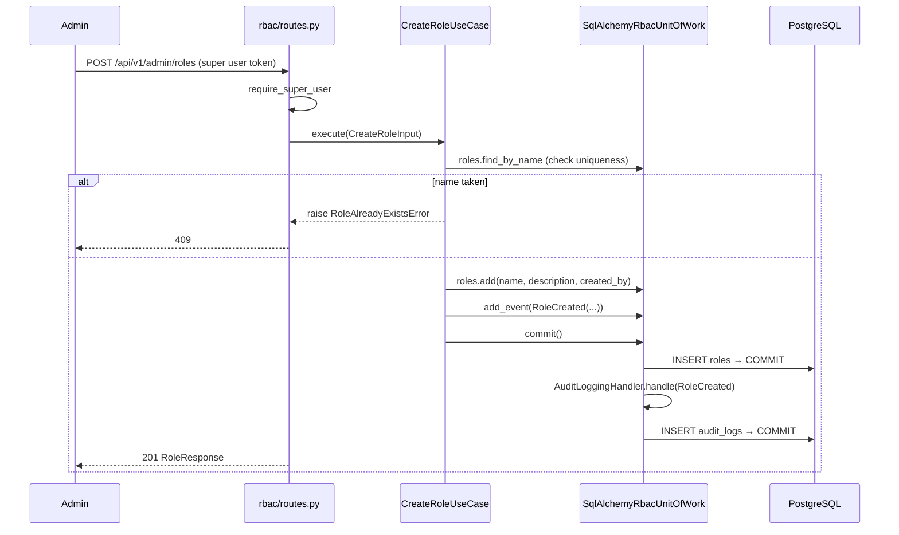
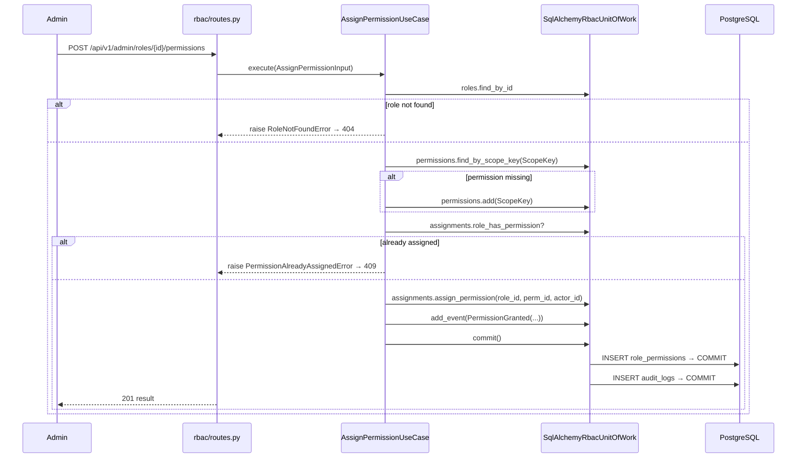
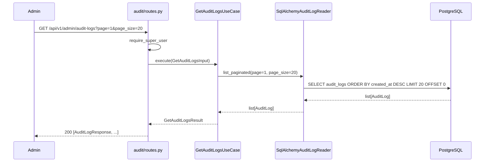
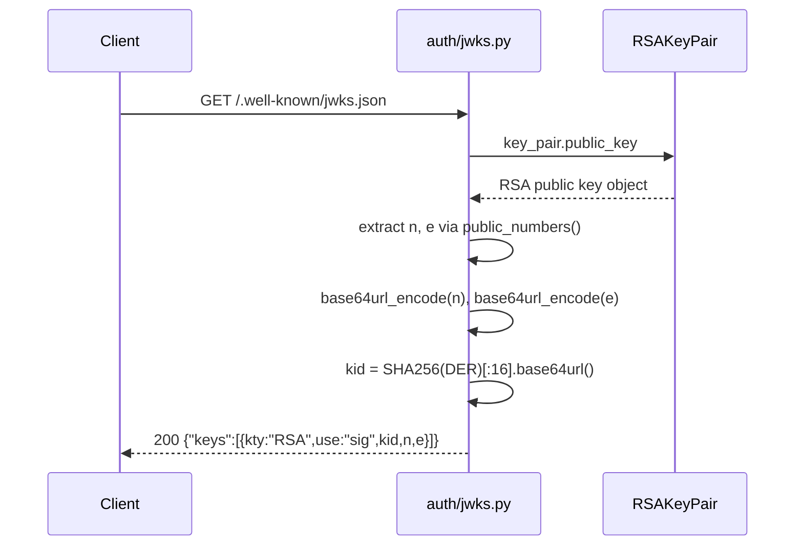
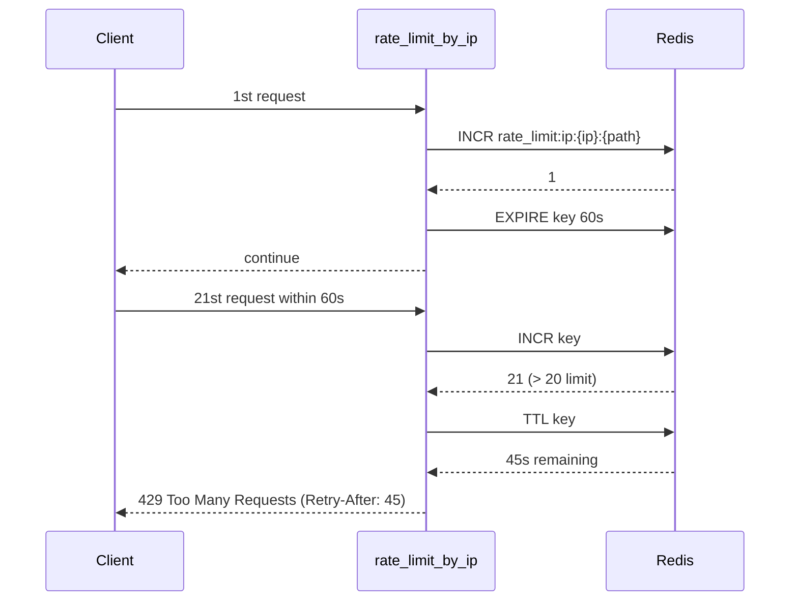

# Sequence Diagrams

Key flows in the Access Control Service.

---

## 1. User Signup

---

## 2. User Login

---

## 3. Token Refresh

---

## 4. Logout

---

## 5. Protected Endpoint (Token Validation)

---

## 6. Create Role (RBAC with Domain Events)

---

## 7. Assign Permission to Role

---

## 8. Get Audit Logs

---

## 9. JWKS Endpoint

---

## 10. Rate Limiting

