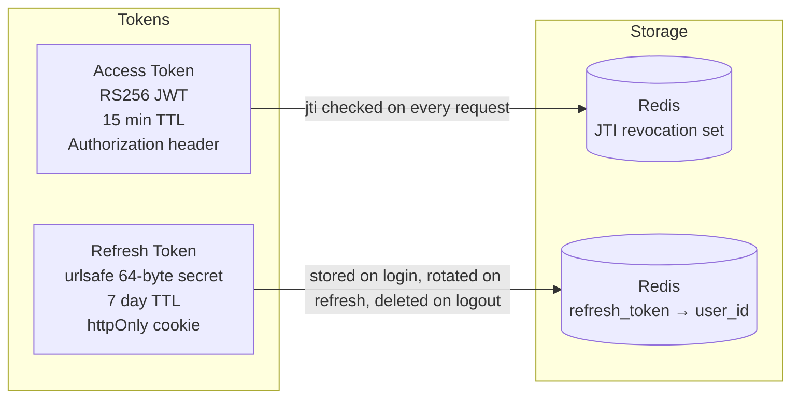
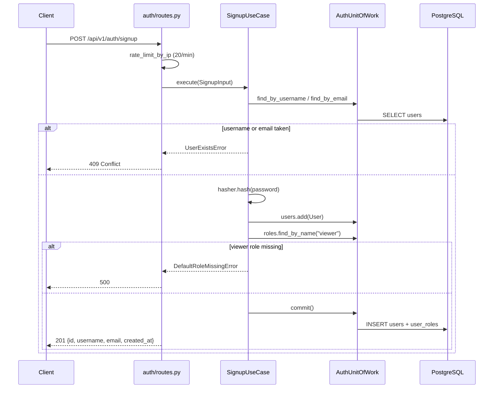
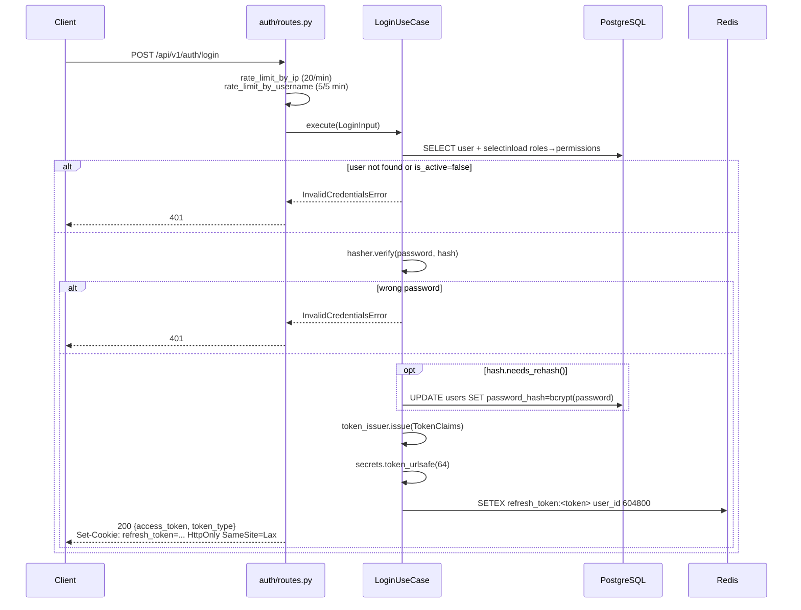
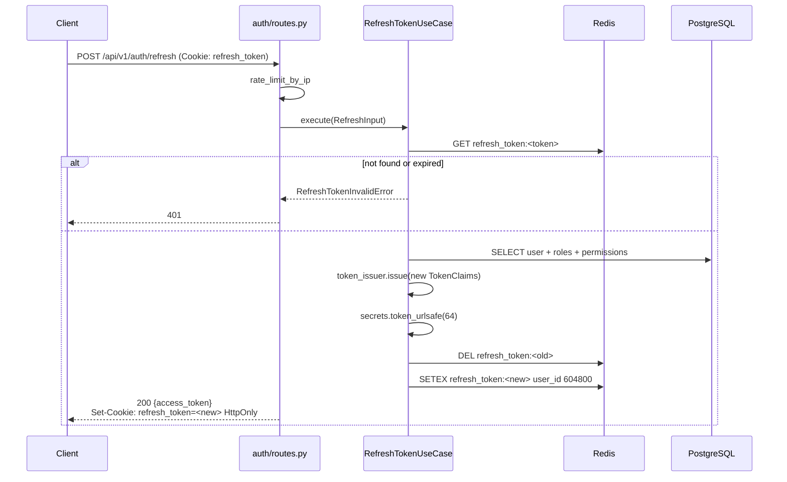
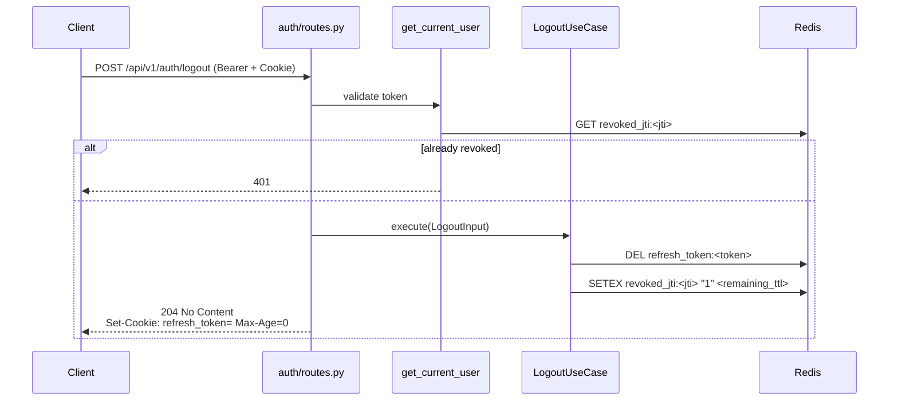
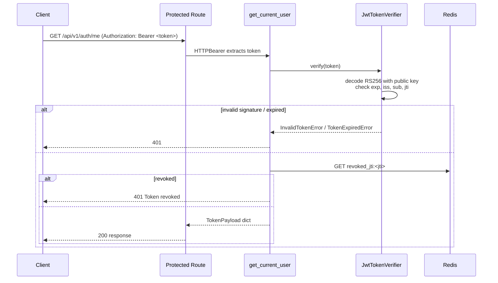
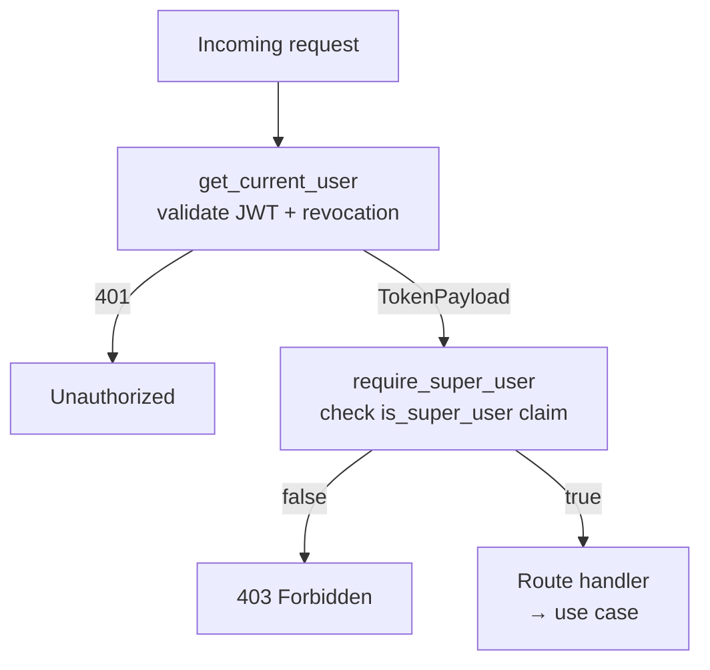
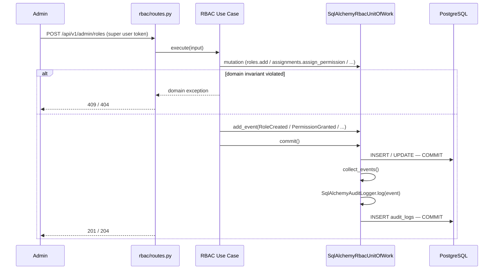
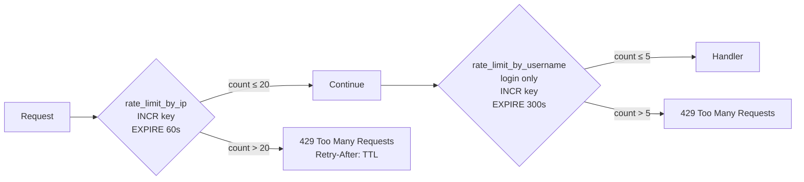

# Authentication & Authorisation Flows

## Token Architecture

**Access token claims:** `sub`, `iss`, `iat`, `exp`, `jti`, `username`, `roles[]`, `permissions[]`, `is_super_user`

---

## Signup

---

## Login

---

## Token Refresh

---

## Logout

---

## Protected Endpoint — Token Validation

Every request to a protected route goes through `get_current_user` before the handler runs.

---

## Admin Endpoint — Super User Guard

RBAC mutation routes add `require_super_user` on top of `get_current_user`.

---

## RBAC Mutation with Domain Event → Audit

Every admin write operation follows this pattern. The audit log is written in the same DB transaction via the Unit of Work — no eventual consistency risk.

---

## Rate Limiting Logic

