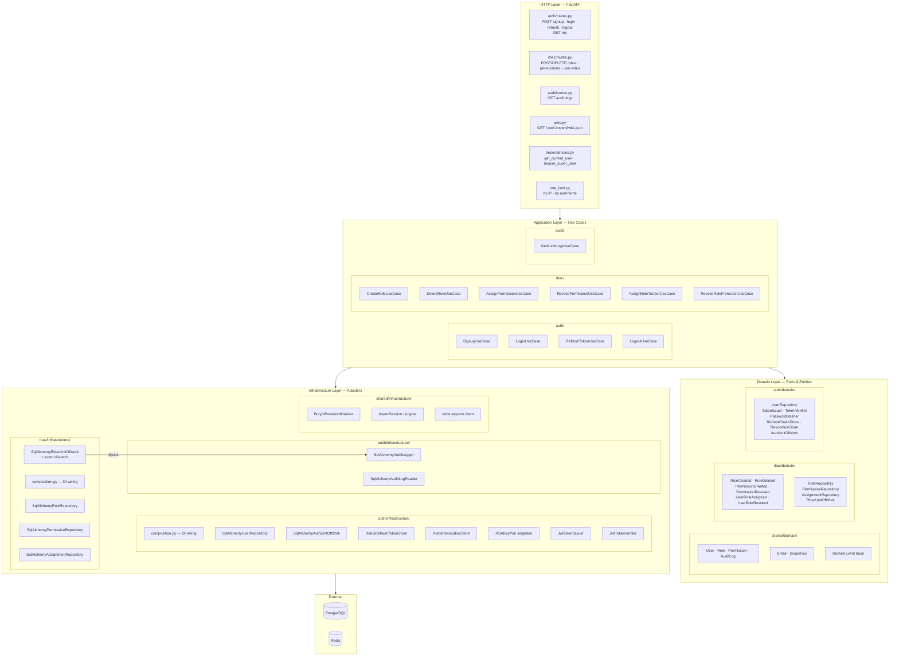
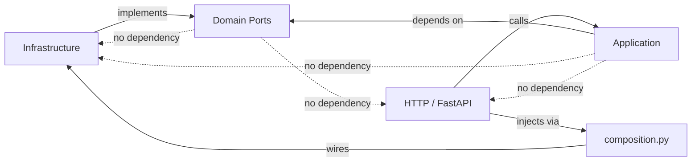
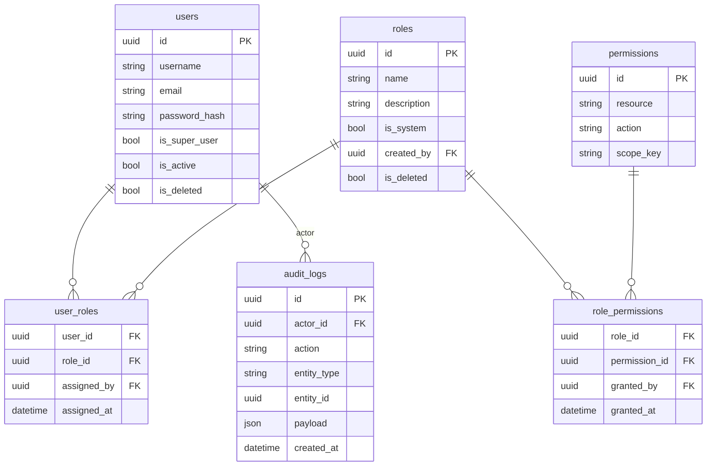

# IAM Service — Internal Map

The iam-service is structured as a hexagonal (ports & adapters) application with three bounded contexts. This document maps the internal components and their relationships.

## Bounded Context Layout

## Dependency Rules

The domain layer has **zero** imports from FastAPI, SQLAlchemy, Redis, or PyJWT. All wiring happens in `composition.py` files using FastAPI `Depends`.

## Key Redis Key Patterns

| Key | Value | TTL |
|-----|-------|-----|
| `refresh_token:<token>` | `<user_id>` | 7 days |
| `revoked_jti:<jti>` | `"1"` | remaining access token lifetime |
| `rate_limit:ip:<ip>:<path>` | request count | 60 s |
| `rate_limit:username:<username>:<path>` | attempt count | 300 s |

## ORM Association Tables

