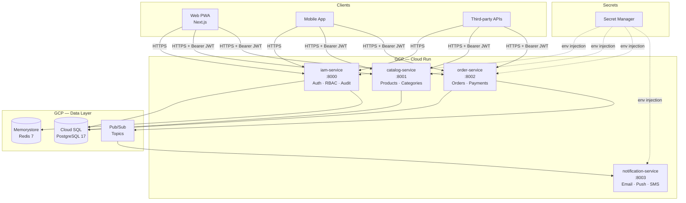
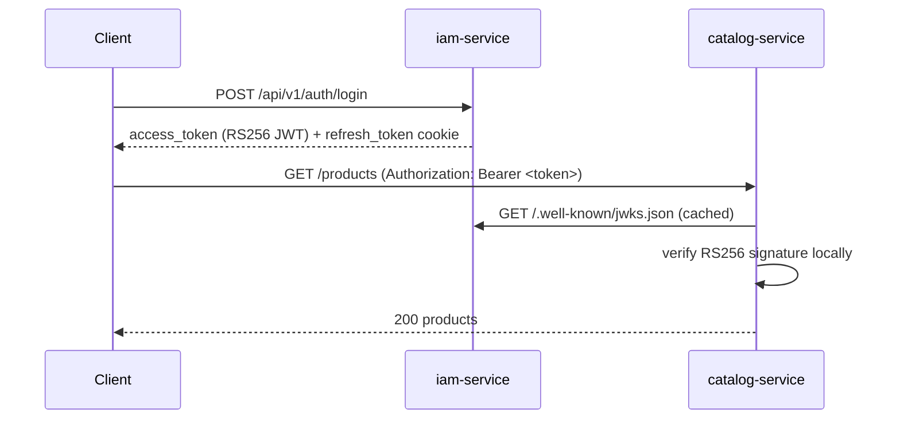

# System Overview

Shop-Monorepo is an ecommerce backend platform composed of four Python microservices sharing a PostgreSQL cluster, Redis, and GCP Pub/Sub. Each service is independently deployable to GCP Cloud Run.

## Platform Map



## Responsibilities

| Service | Owns | Does NOT own |
|---------|------|--------------|
| **iam-service** | User identities, roles, permissions, audit log, token issuance | Business domain logic |
| **catalog-service** | Products, categories, inventory | Who can access them |
| **order-service** | Order lifecycle, payment events | Stock management |
| **notification-service** | Delivery of messages via channels | When or why to send them |

## Token Flow

Every protected endpoint in catalog and order services validates JWTs issued by iam-service using the public key served at `/.well-known/jwks.json`. No service-to-service credential exchange is needed.



## Local Development

All services start together via Docker Compose from the repo root:

```bash
docker-compose up
# postgres :5432 · redis :6379 · pubsub-emulator :8085
# iam :8000 · catalog :8001 · order :8002 · notification :8003
```

## Deployment

Each service has its own CI pipeline (`.github/workflows/<service>.yml`) that lints, tests, builds a Docker image, and deploys to Cloud Run on push to `main`.
